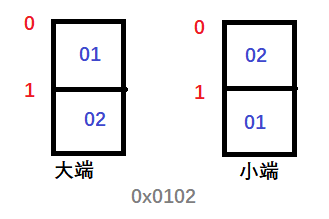
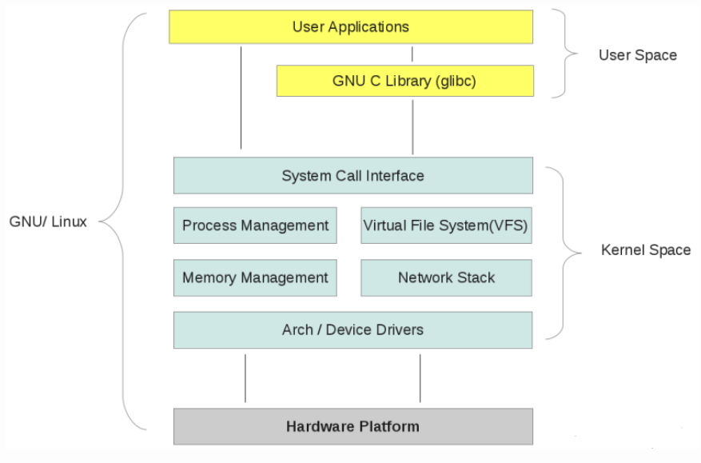

# Linux服务器编程

参考：

	- 《Linux高性能服务器编程》，游双 著.

## 0. Linux编程基础

- **主机字节序和网络字节序**

> `大端字节序（big endian）`：一个整数的高位字节（23~31bit）存储在内存的低地址处，低位字节（0~7bit）存储在内存的高位地址处。
>
> `小端字节序（little endian）`：与大端字节序相反。



下面用`c++`来实现一下大小端的判断：

```c++
void byte_order() {
	union
	{
		short value;
		char union_bytes[sizeof(short)];
	}test;

	test.value = 0x0102;
	if ((1 == test.union_bytes[0]) && (2 == test.union_bytes[1])) { // 对应上图左边
		printf("Big endian\n");
	}
	else if ((2 == test.union_bytes[0]) && (1 == test.union_bytes[1])) { // 对应上图右边
		printf("Little endian\n");
	}
	else {
		printf("Unknown...\n");
	}
}
```

现代PC大多采用`小端字节序`，所以小端字节序也叫做`主机字节序`。当格式化的数据在两台使用不同字节序的主机上直接传递时，接收端必然会出错，解决方法是：发送端总是把要发送的数据转化成<u>大端字节序</u>数据后再发送。所以`大端字节序`也称之为`网络字节序`。

> 课代表：
>
> （1） 小端字节序 <==> 主机字节序；
>
> （2） 大端字节序 <==> 网络字节序。

为啥要介绍这个呢？当然是要引入下面的函数呀~~

```c++
// 主机字节序 和 网络字节序 之间的转换函数
#include <netinet/in.h>
unsigned long int htonl(unsigned long int hostlong);	// 看名字: host to network long
unsigned short int htons(unsigned short int hostshort);
unsigned long int ntohl(unsigned long int netlong);
unsigned short int ntohs(unsigned short int netshort);
```

- **一些基本的API：**

使用`socket`的一般步骤为：

​	**（1） 创建socket ：**`int socket(int domain, int type, int protocol)`

​					`domain`：使用哪个底层协议，可选`PF_INET`(IPv4)、`PF_INET6`(IPv6)和`PF_UNIX`(UNIX本地域协议族)；

​					`type`: 指定服务类型，主要有`SOCK_STREAM`(TCP)和`SOCK_DGRAM`(UDP)；

​					`protocol`: 一般取0。

​					socket系统调用成功时返回一个<u>socket文件描述符</u>，失败返回-1并设置errno。

​	**（2）命名socket：** 绑定地址，`int bind(int sockfd, const struct sockaddr *my_addr, socklen_t addrlen)`

​					bind成功返回0，失败返回-1并设置errno。

​	**（3） 监听socket：**  `int listen(int sockfd, int backlog)`

​					`backlog`: 提示内核监听队列的最大长度，监听队列的长度如果超过了backlog，服务器将不受理新的客户连接，客户端收到

​			`ECONNREFUSED`的错误信息。

​	**（4）发起连接：** `int connect(int sockfd, const struct sockaddr *serv_addr, socklen_t addrlen)`

​					`serv_addr`: 服务器监听的socket地址。

​					connect成功时返回**<u>0</u>**，失败返回-1并设置errno。一旦连接成功，sockfd就唯一标识这个连接，客户端就可以通过读写sockfd			来与服务器通信。

​	**（5）接受连接：** `int accept(int sockfd, struct sockaddr *addr, socklen_t *addrlen)`

​					`addr`: 用来获取被接受连接的远端socket地址；

​					`addrlen`: 指出socket地址的长度。

​					accept成功返回一个新的连接socket，该socket唯一地标识了被接受的这个连接，服务器可通过读写该socket来与被接受连接			对应的客户端通信。失败是返回-1并设置errno。

​	**（6）关闭连接：** `int close(int fd)` 和 `int shutdown(int sockfd, int howto)`

​					`close`系统调用并不总是立即关闭一个连接，而是将`fd`的引用计数-1，直到`fd`的引用计数为0时，才真正关闭连接。                 			`shutdown`则是立即终止连接。`howto`有三个可选值：`SHUT_RD`(关闭sockfd上读的一半)、`SHUT_WR`(关闭sockfd上写的一半)和		`SHUT_RDWR`(同时关闭sockfd上的读和写)。

下面是基本的流程：

```c++
int sock = socket(PF_INET, SOCK_STREAM, 0);		// 创建socket，返回的`sock`是socket文件描述符
assert(sock >= 0);								// 失败返回-1，判断是否创建成功

// 创建一个IPv4 socket地址
struct sockaddr_in address;
bzero(&address, sizeof(address));				// 将address整块空间清零
address.sin_family = AF_INET;					// 底层使用 IPv4 协议
inet_pton(AF_INET, ip, &address.sin_addr);		// 点分十进制 --> 二进制整数
address.sin_port = htons(port);					// 主机字节序 --> 网络字节序, 看看看，上面介绍的大小端有用吧

// 命名socket
int ret = bind(sock, (struct sockaddr*)&address, sizeof(address));	// 将sock绑定到ip地址
assert(ret != -1);													// 判断是否执行成功

// 监听socket
ret = listen(sock, backlog);
assert(ret != -1);

// 发起连接
int sockfd = socked(PF_INET, SOCK_STREAM, 0);
assert(connect(sockfd, (struct sockaddr*)&server_address, sizeof(server_address)) == 0);

// 接受连接
struct sockaddr_in client;						// 客户端IPv4地址
socklen_t client_addrlength = sizeof(client);
int connfd = accept(sock, (struct sockaddr*)&client, &client_addrlength);
assert(connfd >= 0);							// 判断是否执行成功
```

上面第5行中的`sockaddr_in`是IPv4的socket地址结构体：

```c++
struct sockaddr_in {
    sa_family_t sin_family;			// 地址族：AF_INET
    uint16_t sin_port;				// 端口号，用网络字节序表示
    struct in_addr sin_addr;		// IPv4地址结构体
};

struct in_addr {
    uint32_t s_addr;				// IPv4地址，用网络字节序表示
};
```

## 1. Linux基本知识

- **用户态与内核态**

  参考：

  - [Linux内核空间与用户空间](https://www.cnblogs.com/sparkdev/p/8410350.html)

  - [内核态与用户态、系统调用与库函数、文件IO与标准IO、缓冲区等概念介绍](https://blog.csdn.net/windeal3203/article/details/79083453)

  > 课代表：
  >
  > （1）Linux操作系统分为内核空间和用户空间；
  >
  > （2）内核空间被所有进程共享；
  >
  > （3）内核独立于普通的应用程序(进程)，可以访问受保护的内存空间和低层硬件设备等；
  >
  > （4）当进程运行在内核空间时就处于内核态，运行于用户空间则处于用户态；
  >
  > （5）内核态时CPU可以访问所有的数据，包括外围设备（*硬盘、网卡、键盘等*）；用户态时只能访问/操作当前进程拥有的内存空间中的数据；
  >
  > （6）如果要读写网络数据，需要通过系统调用read()/write()，从用户态切换到内核态。

  

- **IO同步与IO异步**

  > POSIX(可移植操作系统接口)把IO同步定义为：*导致进程阻塞直到IO完成的操作*。反之则是异步IO。

- **IO模型**

  socket的基础API中，`accept`、`send`、`recv`、`connect`这四个常用的系统调用函数都可以设置为阻塞/非阻塞。为了说明概念，下面就用

  **（1）阻塞IO模型：** 执行的系统调用可能因为无法立即完成而被操作系统挂起，直到等待的事件发生为止。比如张三同学在做题的时候口渴了，拿着水杯去打水，打开水龙头装满水然后离开，如果水龙头没有水，他也要等到有水并装满被子才能回去写作业。（这样张三总是<u>一次</u>就能打到水）

  （2）**非阻塞IO模型：**执行的系统调用总是立即返回，而不管事件是否已经发生。如果事件没有立即发生，返回`-1`，并设置`errno`。比如还是张三去打水，他打开水龙头后发现没有水，就回去做题了，过一会再来看看（这时候是非阻塞的），直到来了第n次，诶，刚好有水了，他接满水<u>才能</u>回去写题（这时候是阻塞的，为了喝杯水，张三来了<u>n次</u>！！！）。所以它还是**IO同步**的。而且，我们只有在事件已经发生的情况下操作非阻塞IO，才能提高程序的效率，所以要跟其他IO通知机制（比如IO复用、SIGIO信号）一起用才更有用。

  参考：

  	- [select、poll、epoll之间的区别总结（IO同、异步、（非）阻塞）----内核态、用户态](https://www.cnblogs.com/langzibin/p/7755783.html)
  	- 游双《Linux高性能服务器编程》

  > 课代表：
  >
  > （0）上面两个都是**同步IO**
  >
  > （1）非阻塞IO + IO通知机制 = very good
  >
  > （2）IO通知机制 = IO复用 + SIGIO信号

- **IO通知机制：**

  - IO复用（最常用）：应用程序通过IO复用函数（select、poll、epoll_wait）向内核注册一组事件，内核通过IO复用函数把其中就绪的事件通知给应用程序。IO复用函数本身是**阻塞的**，能提高程序效率的原因是它们<u>具有同时监听多个IO事件的能力</u>。
  - SIGIO信号：为一个目标文件描述符指定宿主进程，那么被指定的宿主进程将捕获到SIGIO信号，当目标文件描述符上有事件发生时，SIGIO信号的信号处理函数将被触发，我们也就可以在该信号处理函数中对目标文件描述符执行**非阻塞IO**操作了。

  > 课代表：
  >
  > （1）IO复用：程序阻塞于IO复用系统调用，但可以同时监听多个IO事件。duiIO本身的读写操作是非阻塞的；
  >
  > （2）SIGIO信号：信号触发读写就绪事件，用户程序执行读写操作。程序没有阻塞阶段。
  >
  > ​                                                                                                                              ---- 游双《Linux高性能服务器编程》第八章（P127）